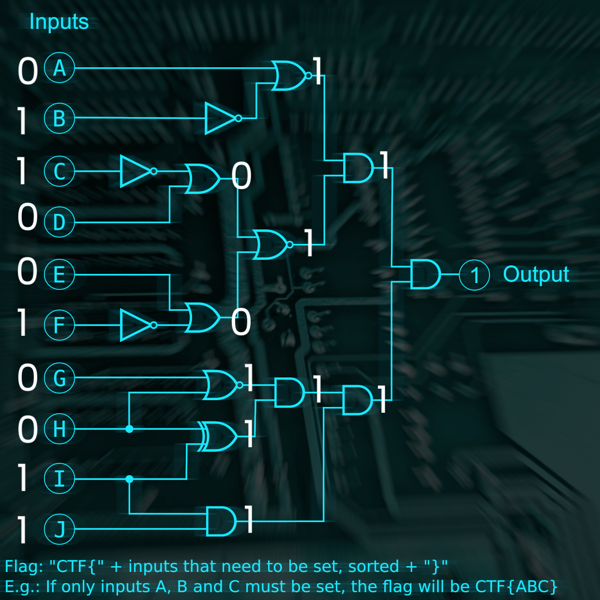
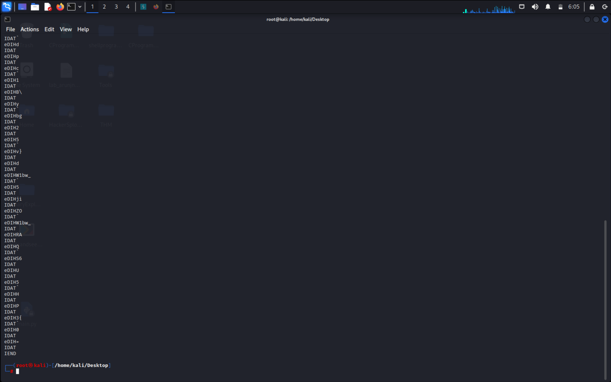

# Google CTF Beginners Quest

### Task 1 : CHEMICAL PLANT CCTV (REV)

LINK : https://cctv-web.2021.ctfcompetition.com/

```js
/*
Task - 1
CHEMICAL PLANT
Category : Reverse Engineering
*/

// Main task is to identify what charCodeAt function does in the javascript

/*
p[0] === 52037 &&
     p[6] === 52081 &&
     p[5] === 52063 &&
     p[1] === 52077 &&
     p[9] === 52077 &&
     p[10] === 52080 &&
     p[4] === 52046 &&
     p[3] === 52066 &&
     p[8] === 52085 &&
     p[7] === 52081 &&
     p[2] === 52077 &&
     p[11] === 52066
*/

const chars_req = [
  52037, 52077, 52077, 52066, 52046, 52063, 52081, 52081, 52085, 52077, 52080,
  52066,
];

ans = "";

for (let i = 0; i < chars_req.length; i++) {
  ans += String.fromCharCode(chars_req[i] - 0xcafe);
}

console.log(ans);
```

**ANS : GoodPassword**

### Task 2 : APARTMENT LOGIC LOCK (MISC)

</img>

**ANS : CTF{BCFIJ}**

### Task 3 : HIGH SPEED CHASE (MISC)

```js
function controlCar(scanArray) {
  // We need to calculate the maximum distance of the nearest obstacle
  let max_distance = scanArray[0];
  let max_distance_index = 0;
  for (let i = 0; i < 17; i++) {
    if (max_distance < scanArray[i]) {
      max_distance = scanArray[i];
      max_distance_index = i;
    }
  }

  // if max distance is equal for 7,8,9 indexes then move straight
  if (
    max_distance == scanArray[7] &&
    max_distance == scanArray[8] &&
    max_distance == scanArray[9]
  ) {
    return 0;
  }

  if (max_distance_index < 8) {
    return -1;
  }

  if (max_distance_index > 8) {
    return 1;
  }

  return 1;
}
```

**ANS : CTF{cbe138a2cd7bd97ab726ebd67e3b7126707f3e7f}**

### Task 5 : TWISTED ROBOT (MISC)

**///code avialable above in folder named "twisted robot"///**

The vulnerable function is **getrandbits** which is there in the encodeSecret function
Now we can decrypt our secret using this method :

https://github.com/eboda/mersenne-twister-recover

Now we need to write our script to decode our secret. As we read from th readme we need 624 set of integers in order to decrypt our secret and if we notice we will see that there are 624 phone numbers now we will make array out of the 624 phone numbers and format them as below ->

**arrayNum.py**

```python
array_num = [2631706234 - (1<<31),
4675537030 - (1<<31),
2201461293 - (1<<31),
6303286023 - (1<<31),
4135530465 - (1<<31),
5284036609 - (1<<31),
4546416157 - (1<<31),
3969061900 - (1<<31),
...
...
...]
```

Now we need to Clone 🔗 the repo above into our folder in order to use the function.

```bash
git clone https://github.com/eboda/mersenne-twister-recover
```

Now we will write our script ->

**exploit.py**

Take the code given in the readme of the repo and modify it 🧰

```python
from MTRecover import MT19937Recover
from arrayNum import array_num
# Not needed
# r1 = random.Random(31337)
# outputs = [r1.getrandbits(32) for _ in range(625)]

mtr = MT19937Recover()
r2 = mtr.go(array_num)

# Write our encode function here
# We removed the encode function because we don't need to do that


def encodeSecret(s):
    key = [r2.getrandbits(8) for i in range(len(s))]
    return bytes([a ^ b for a, b in zip(key, s)])


# Now opening/creating our secret.enc file
with open("secret.enc", "rb") as f:
    data = f.read()

print(encodeSecret(data))

# assert r1.getrandbits(32) == r2.getrandbits(32)
```

**ANS : CTF{n3v3r_3ver_ev3r_use_r4nd0m}**

### Task 7 : READYSETACTION (CRYPTO)

Our given script is :

```python
from Crypto.Util.number import *

flag = b"REDACTED"

p = getPrime(1024)
q = getPrime(1024)
n = p*q

m = bytes_to_long(flag)

c = pow(m, 3, n)  # c = m^3 % n

print(c)
print("----------------------------")
print(n)
# 15478048932253023588842854432571029804744949209594765981036255304813254166907810390192307350179797882093083784426352342087386691689161026226569013804504365566204100805862352164561719654280948792015789195399733700259059935680481573899984998394415788262265875692091207614378805150701529546742392550951341185298005693491963903543935069284550225309898331197615201102487312122192298599020216776805409980803971858120342903012970709061841713605643921523217733499022158425449427449899738610289476607420350484142468536513735888550288469210058284022654492024363192602734200593501660208945967931790414578623472262181672206606709
# 21034814455172467787319632067588541051616978031477984909593707891829600195022041640200088624987623056713604514239406145871910044808006741636513624835862657042742260288941962019533183418661144639940608960169440421588092324928046033370735375447302576018460809597788053566456538713152022888984084306297869362373871810139948930387868426850576062496427583397660227337178607544043400076287217521751017970956067448273578322298078706011759257235310210160153287198740097954054080553667336498134630979908988858940173520975701311654172499116958019179004876438417238730801165613806576140914402525031242813240005791376093215124477

```

After analysing 🚀 we get main thing as :

- Flag is converted into integer and stored in variable 'm'
- var 'c' can be rewritten as : c = m^3 % n
- to get 'm' we can rewrite our function as : m^3 = k\*n + c => m = (k\*n + c)^(1/3)

We will write a script keeping all these points in mind 🧠

**///code avialable above in folder named "readysetaction"///**

**SOLUTION**

```python
from Crypto.Util.number import *
import gmpy2  # to handle long integers

c = 15478048932253023588842854432571029804744949209594765981036255304813254166907810390192307350179797882093083784426352342087386691689161026226569013804504365566204100805862352164561719654280948792015789195399733700259059935680481573899984998394415788262265875692091207614378805150701529546742392550951341185298005693491963903543935069284550225309898331197615201102487312122192298599020216776805409980803971858120342903012970709061841713605643921523217733499022158425449427449899738610289476607420350484142468536513735888550288469210058284022654492024363192602734200593501660208945967931790414578623472262181672206606709
n = 21034814455172467787319632067588541051616978031477984909593707891829600195022041640200088624987623056713604514239406145871910044808006741636513624835862657042742260288941962019533183418661144639940608960169440421588092324928046033370735375447302576018460809597788053566456538713152022888984084306297869362373871810139948930387868426850576062496427583397660227337178607544043400076287217521751017970956067448273578322298078706011759257235310210160153287198740097954054080553667336498134630979908988858940173520975701311654172499116958019179004876438417238730801165613806576140914402525031242813240005791376093215124477

k = 0  # variable

# EQUATION : m^3 = k*n + c => m = (k*n + c)^(1/3)

while True:
    a = gmpy2.iroot(k*n + c, 3)[1]
    if a:
        break
    k += 1

print(long_to_bytes(gmpy2.iroot(k*n + c, 3)[0]))

# OUTPUT : b'CTF{34sy_RS4_1s_e4sy_us3}\x00\x00\x00\x00\x00\x00\x00\x00\x00\x00\x00\x00\x00\x00\x00\x00\x00\x00\x00\x00\x00\x00\x00\x00\x00\x00\x00\x00\x00\x00\x00\x00\x00\x00\x00\x00\x00\x00\x00\x00\x00\x00\x00\x00\x00\x00\x00\x00\x00\x00\x00\x00\x00\x00\x00\x00\x00\x00\x00\x00\x00'
```

**ANS : CTF{34sy_RS4_1s_e4sy_us3}**

### Task 8 : HIDEANDSEEK (MISC)

This is not a simple stegnographic challenge we need to analyse the strings in the image and we cna learn more about it here on this website :

http://www.libpng.org/pub/png/spec/1.2/PNG-Chunks.html

Here as we can see that there is and eDIH chunk which contains the image data chunks

</img>

Now the layout of the eDIH chunk is something like this

```txt
- LENGTH
- CHUNK TYPE
- CHUNK DATA // We only need this
- CRC
```

SOLUTION :

```python
import base64
from http.client import NOT_EXTENDED
import re

# opening the image file
with open("./main.png", 'rb') as f:
    data = f.read()

# print(data)
# to find all the "eDIH" chunks in image data using regex
needed = []
for loc in re.finditer(b"eDIH", data):
    # print(loc.end())
    needed.append(loc.end())

flag = ""

for i in needed:
    # print(chr(data[i]))
    flag += chr(data[i])

print(flag)

# OUTPUT : Q1RGe0RpZFlvdUtub3dQTkdpc1Byb25vdW5jZWRQSU5HP30=

# Decoding from base 64

print(base64.b64decode(flag))
```

**ANS : CTF{DidYouKnowPNGisPronouncedPING?}**
